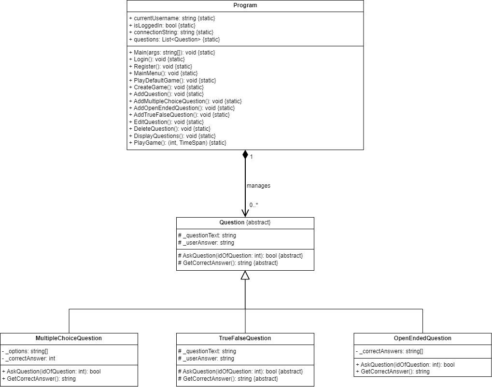
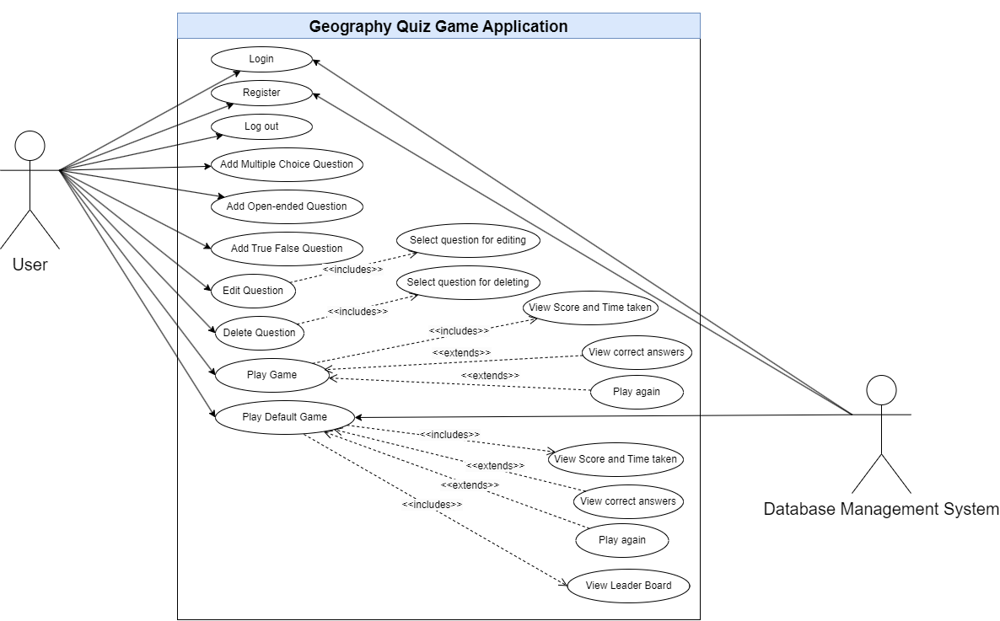

# Geography Quiz Game

A C# console application that allows users to create and play geography quiz games. Users can manage questions, track scores, and play quizzes in different modes. The application supports multiple question types, user authentication, and a leaderboard.

📌 Table of Contents
1. [Introduction](#introduction)
2. [Features](#features)
3. [Installation](#installation)
4. [Usage](#usage)
5. [Technologies Used](#technologies-used)
6. [Contributing](#contributing)
7. [Class Diagram](#class-diagram)
8. [Use Case Diagram](#use-case-diagram)

---

## Introduction

**Geography Quiz Game** is a Windows-based C# console application designed to test and improve your geography knowledge. It operates in two modes:

- **Create Mode**: Allows users to add, edit, and delete questions.
- **Play Mode**: Users can take a quiz and answer various types of geography questions such as multiple-choice, open-ended, and true/false.

The application also supports user authentication, a default game mode with pre-made questions, and a leaderboard that tracks the top scores.

---

## Features

- **Create Mode**:
  - Add, edit, and delete questions.
  - Manage multiple types of questions: multiple-choice, true/false, and open-ended.

- **Play Mode**:
  - Take a quiz with shuffled questions and options.
  - View your score and review correct answers after completing the quiz.

- **User Authentication**:
  - Login and register functionalities for personalized access.

- **Default Game Mode**:
  - Play a pre-made quiz with stored geography questions.
  - Track scores and display a leaderboard for top players.

- **Enhanced User Interface**:
  - Clear and intuitive text-based interface with color highlights for better user experience.

---

## Installation

To run the Geography Quiz Game on your local machine, follow these steps:

1. Clone the repository:
   ```bash
   git clone https://github.com/DangBach1410/game.git
   ```
2. Open the project in Visual Studio or any C# IDE.

3. Compile and run the project.

4. The application will launch in the console window.

## Usage

### Create Mode:
- Add, edit, or delete questions by selecting options in the menu.

### Play Mode:
- Choose to play a quiz.
- Answer the questions and see your score at the end.

### Default Game Mode:
- Play a pre-made quiz with questions fetched from the database.
- View the leaderboard after completing the quiz.

### Authentication:
- Register for a new account or login to access additional features like creating quizzes and checking the leaderboard.

---

## Technologies Used

- **C#**: Programming language used to build the console application.
- **.NET Framework**: The framework that supports the development of the application on Windows.

---

## Contributing

Contributions to the Geography Quiz Game are welcome! If you would like to contribute, please follow these steps:

1. Fork the repository.
2. Create a new branch for your changes.
3. Submit a pull request detailing your changes.

---

## Class Diagram


---

## Use Case Diagram

